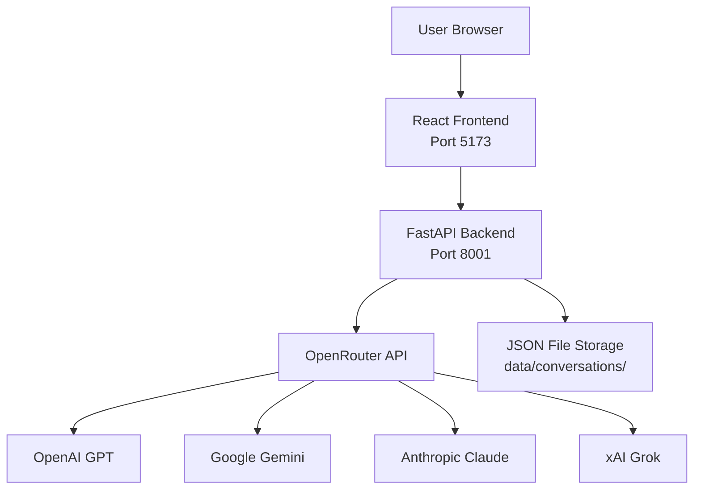
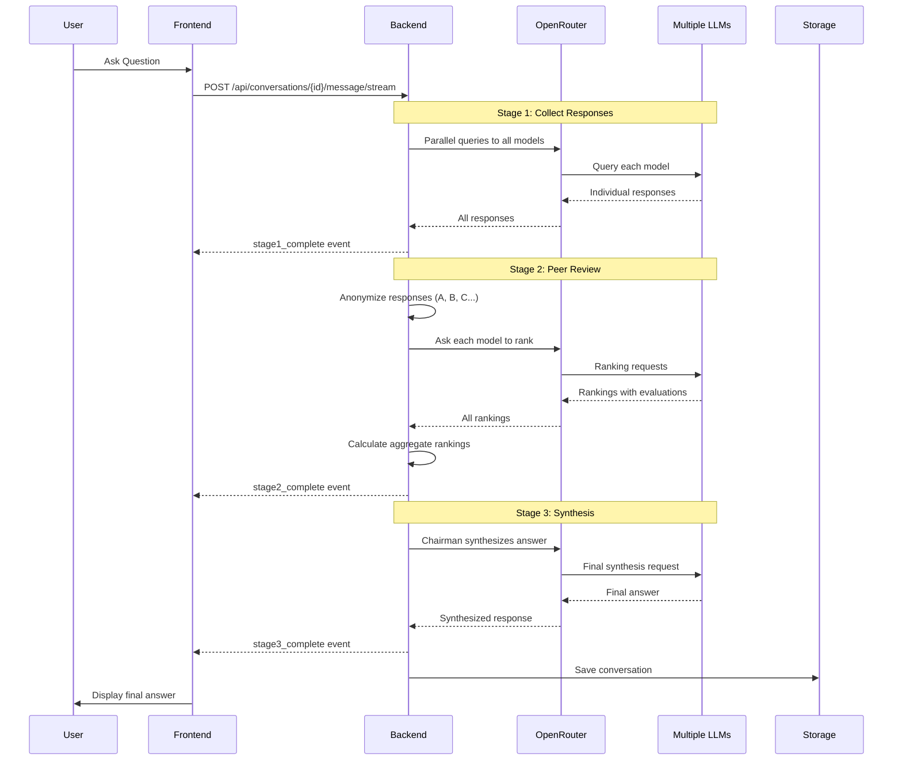

# LLM Council - Comprehensive Code Analysis


## 📋 Table of Contents
1. [Project Overview](#project-overview)
2. [Architecture & Design](#architecture--design)
3. [Backend Deep Dive](#backend-deep-dive)
4. [Frontend Deep Dive](#frontend-deep-dive)
5. [Data Flow & Process](#data-flow--process)
6. [Key Innovations](#key-innovations)
7. [Technology Stack](#technology-stack)

---

## 🎯 Project Overview

### What is LLM Council?

LLM Council is a sophisticated web application that aggregates responses from multiple Large Language Models (LLMs) to provide better, more comprehensive answers. Instead of relying on a single AI model, it:

1. **Queries multiple LLMs in parallel** (GPT, Gemini, Claude, Grok, etc.)
2. **Has them peer-review each other** (anonymously to prevent bias)
3. **Synthesizes a final answer** from a designated "Chairman" model

### The Core Innovation

The key innovation is **anonymized peer review** in Stage 2. Models evaluate each other's responses without knowing which model produced which answer (they see "Response A", "Response B", etc.), preventing favoritism or bias.

---

## 🏗️ Architecture & Design

### System Architecture



### 3-Stage Process



### Directory Structure

```
llm-council-master/
├── backend/                  # Python FastAPI backend
│   ├── __init__.py
│   ├── config.py            # Configuration & model selection
│   ├── openrouter.py        # OpenRouter API client
│   ├── council.py           # 3-stage council logic
│   ├── main.py              # FastAPI application
│   └── storage.py           # JSON-based persistence
├── frontend/                # React + Vite frontend
│   ├── src/
│   │   ├── App.jsx          # Main application
│   │   ├── api.js           # Backend API client
│   │   ├── components/
│   │   │   ├── Sidebar.jsx       # Conversation list
│   │   │   ├── ChatInterface.jsx # Main chat UI
│   │   │   ├── Stage1.jsx        # Individual responses
│   │   │   ├── Stage2.jsx        # Peer rankings
│   │   │   └── Stage3.jsx        # Final answer
│   │   └── index.css        # Global styles
│   └── package.json
├── data/conversations/      # JSON conversation storage
├── pyproject.toml          # Python dependencies
├── .env                    # API keys (not in git)
└── start.sh                # Convenience startup script
```

---

## 🔧 Backend Deep Dive

### 1. Configuration ([config.py](file:///Users/annamalai/Downloads/Annamalai/LLM%20Council/llm-council-master/backend/config.py))

**Purpose**: Centralized configuration for the council

**Key Components**:
```python
# Council members - these models provide initial responses and peer reviews
COUNCIL_MODELS = [
    "openai/gpt-5.1",
    "google/gemini-3-pro-preview",
    "anthropic/claude-sonnet-4.5",
    "x-ai/grok-4",
]

# Chairman - synthesizes the final answer
CHAIRMAN_MODEL = "google/gemini-3-pro-preview"

# OpenRouter API configuration
OPENROUTER_API_KEY = os.getenv("OPENROUTER_API_KEY")
OPENROUTER_API_URL = "https://openrouter.ai/api/v1/chat/completions"
```

**How It Works**:
- Loads API key from `.env` file using `python-dotenv`
- Council models can be any valid OpenRouter model identifiers
- Chairman model can be the same as one of the council members or different
- Uses OpenRouter as a unified API gateway to access multiple LLM providers

---

### 2. OpenRouter Client ([openrouter.py](file:///Users/annamalai/Downloads/Annamalai/LLM%20Council/llm-council-master/backend/openrouter.py))

**Purpose**: Async HTTP client for querying LLMs via OpenRouter

**Key Functions**:

#### `query_model(model, messages, timeout=120.0)`
```python
async def query_model(model, messages, timeout=120.0) -> Optional[Dict]:
    """Query a single LLM model"""
```

**What it does**:
- Makes async HTTP POST request to OpenRouter API
- Sends messages in OpenAI-compatible format
- Returns parsed response with content and optional reasoning details
- Graceful error handling - returns `None` on failure (doesn't crash)

**Request format**:
```json
{
  "model": "openai/gpt-5.1",
  "messages": [
    {"role": "user", "content": "Your question here"}
  ]
}
```

#### `query_models_parallel(models, messages)`
```python
async def query_models_parallel(models, messages) -> Dict[str, Optional[Dict]]:
    """Query multiple models simultaneously"""
```

**What it does**:
- Creates async tasks for all models using `asyncio.gather()`
- Runs all queries concurrently for speed
- Returns dict mapping model name to response
- Critical for performance - 4 models queried in parallel instead of series

**Example**:
```python
responses = await query_models_parallel(
    ["openai/gpt-5.1", "anthropic/claude-sonnet-4.5"],
    [{"role": "user", "content": "What is 2+2?"}]
)
# Returns: {
#   "openai/gpt-5.1": {"content": "4", "reasoning_details": None},
#   "anthropic/claude-sonnet-4.5": {"content": "The answer is 4", ...}
# }
```

---

### 3. Council Logic ([council.py](file:///Users/annamalai/Downloads/Annamalai/LLM%20Council/llm-council-master/backend/council.py))

**Purpose**: Orchestrates the 3-stage LLM deliberation process

This is the heart of the application. Let's examine each function:

#### Stage 1: `stage1_collect_responses(user_query)`

**Purpose**: Get initial responses from all council members

**Process**:
1. Formats user query as a message list
2. Queries all council models in parallel
3. Filters out failed responses (graceful degradation)
4. Returns list of successful responses

**Code flow**:
```python
messages = [{"role": "user", "content": user_query}]
responses = await query_models_parallel(COUNCIL_MODELS, messages)

stage1_results = []
for model, response in responses.items():
    if response is not None:
        stage1_results.append({
            "model": model,
            "response": response.get('content', '')
        })
```

**Output example**:
```python
[
    {"model": "openai/gpt-5.1", "response": "GPT's answer..."},
    {"model": "google/gemini-3-pro-preview", "response": "Gemini's answer..."},
    {"model": "anthropic/claude-sonnet-4.5", "response": "Claude's answer..."},
    {"model": "x-ai/grok-4", "response": "Grok's answer..."}
]
```

---

#### Stage 2: `stage2_collect_rankings(user_query, stage1_results)`

**Purpose**: Have models peer-review and rank each other's responses

**Process**:
1. **Anonymize** responses as "Response A", "Response B", etc.
2. Create label-to-model mapping for de-anonymization later
3. Build ranking prompt with all anonymous responses
4. Query all models to rank the responses
5. Parse rankings from model outputs
6. Return rankings + mapping

**Anonymization logic**:
```python
# Create labels: A, B, C, D...
labels = [chr(65 + i) for i in range(len(stage1_results))]

# Create mapping
label_to_model = {
    f"Response {label}": result['model']
    for label, result in zip(labels, stage1_results)
}
# Result: {"Response A": "openai/gpt-5.1", "Response B": "google/gemini...", ...}
```

**Ranking prompt** (sent to each model):
```
You are evaluating different responses to the following question:

Question: {user_query}

Here are the responses from different models (anonymized):

Response A:
{first model's response}

Response B:
{second model's response}

...

Your task:
1. First, evaluate each response individually...
2. Then provide a final ranking.

IMPORTANT: Your final ranking MUST be formatted EXACTLY as follows:
- Start with "FINAL RANKING:" 
- Numbered list: "1. Response C", "2. Response A", "3. Response B"
```

**Why this format?**
- Strict format ensures reliable parsing
- Models provide thoughtful analysis first
- Then give parseable ranking at the end

**Parsing logic** (`parse_ranking_from_text`):
```python
def parse_ranking_from_text(ranking_text: str) -> List[str]:
    # Find "FINAL RANKING:" section
    if "FINAL RANKING:" in ranking_text:
        parts = ranking_text.split("FINAL RANKING:")
        ranking_section = parts[1]
        
        # Extract "1. Response A", "2. Response B", etc.
        numbered_matches = re.findall(r'\d+\.\s*Response [A-Z]', ranking_section)
        if numbered_matches:
            return [re.search(r'Response [A-Z]', m).group() for m in numbered_matches]
    
    # Fallback: extract any "Response X" in order
    matches = re.findall(r'Response [A-Z]', ranking_text)
    return matches
```

**Returns**:
- List of rankings (one per model)
- Label-to-model mapping for de-anonymization

---

#### Stage 2 Helper: `calculate_aggregate_rankings(stage2_results, label_to_model)`

**Purpose**: Aggregate all peer reviews into a "leaderboard"

**Method**: Average rank position across all evaluations

**Logic**:
```python
model_positions = defaultdict(list)

# Collect all rankings for each model
for ranking in stage2_results:
    parsed_ranking = parse_ranking_from_text(ranking['ranking'])
    
    for position, label in enumerate(parsed_ranking, start=1):
        if label in label_to_model:
            model_name = label_to_model[label]
            model_positions[model_name].append(position)

# Calculate averages
aggregate = []
for model, positions in model_positions.items():
    avg_rank = sum(positions) / len(positions)
    aggregate.append({
        "model": model,
        "average_rank": round(avg_rank, 2),
        "rankings_count": len(positions)
    })

# Sort by best average (lower is better)
aggregate.sort(key=lambda x: x['average_rank'])
```

**Example output**:
```python
[
    {"model": "anthropic/claude-sonnet-4.5", "average_rank": 1.25, "rankings_count": 4},
    {"model": "openai/gpt-5.1", "average_rank": 2.0, "rankings_count": 4},
    {"model": "google/gemini-3-pro-preview", "average_rank": 2.5, "rankings_count": 4},
    {"model": "x-ai/grok-4", "average_rank": 3.25, "rankings_count": 4}
]
```

This shows Claude was ranked 1st or 2nd most often, averaging position 1.25.

---

#### Stage 3: `stage3_synthesize_final(user_query, stage1_results, stage2_results)`

**Purpose**: Chairman model synthesizes final answer from all information

**Process**:
1. Compile all Stage 1 responses
2. Compile all Stage 2 rankings/evaluations
3. Build comprehensive prompt for chairman
4. Query chairman model
5. Return synthesized answer

**Chairman prompt**:
```
You are the Chairman of an LLM Council. Multiple AI models have provided 
responses to a user's question, and then ranked each other's responses.

Original Question: {user_query}

STAGE 1 - Individual Responses:
Model: openai/gpt-5.1
Response: ...

Model: google/gemini-3-pro-preview
Response: ...

STAGE 2 - Peer Rankings:
Model: openai/gpt-5.1
Ranking: [full evaluation text]

Model: google/gemini-3-pro-preview
Ranking: [full evaluation text]

Your task as Chairman is to synthesize all of this information into a single, 
comprehensive, accurate answer. Consider:
- The individual responses and their insights
- The peer rankings and what they reveal
- Any patterns of agreement or disagreement

Provide a clear, well-reasoned final answer that represents the council's 
collective wisdom:
```

**Why this works**:
- Chairman sees ALL responses and ALL evaluations
- Can identify consensus points
- Can resolve disagreements with context
- Produces more balanced, comprehensive answer than any single model

---

#### Orchestration: `run_full_council(user_query)`

**Purpose**: Runs entire 3-stage process in sequence

**Code flow**:
```python
async def run_full_council(user_query):
    # Stage 1
    stage1_results = await stage1_collect_responses(user_query)
    if not stage1_results:
        return error  # All models failed
    
    # Stage 2
    stage2_results, label_to_model = await stage2_collect_rankings(
        user_query, stage1_results
    )
    aggregate_rankings = calculate_aggregate_rankings(
        stage2_results, label_to_model
    )
    
    # Stage 3
    stage3_result = await stage3_synthesize_final(
        user_query, stage1_results, stage2_results
    )
    
    # Prepare metadata
    metadata = {
        "label_to_model": label_to_model,
        "aggregate_rankings": aggregate_rankings
    }
    
    return stage1_results, stage2_results, stage3_result, metadata
```

**Returns**:
- Stage 1 results (individual responses)
- Stage 2 results (rankings + parsed rankings)
- Stage 3 result (final synthesis)
- Metadata (mapping and aggregates for UI display)

---

#### Bonus: `generate_conversation_title(user_query)`

**Purpose**: Auto-generate conversation title based on first message

**How it works**:
- Uses fast, cheap model (Gemini Flash) for title generation
- Prompts for 3-5 word title
- Cleans up quotes and truncates if too long
- Falls back to "New Conversation" on failure

**Why separate model?**
- Title generation is simple task
- No need to use expensive/slow models
- Runs in parallel with main process to save time

---

### 4. FastAPI Application ([main.py](file:///Users/annamalai/Downloads/Annamalai/LLM%20Council/llm-council-master/backend/main.py))

**Purpose**: REST API server for frontend-backend communication

**Technology**: FastAPI (modern, async Python web framework)

**CORS Setup**:
```python
app.add_middleware(
    CORSMiddleware,
    allow_origins=["http://localhost:5173", "http://localhost:3000"],
    allow_credentials=True,
    allow_methods=["*"],
    allow_headers=["*"],
)
```
Allows frontend (Vite dev server on port 5173) to make requests.

#### API Endpoints

**1. Health Check**
```python
@app.get("/")
async def root():
    return {"status": "ok", "service": "LLM Council API"}
```

**2. List Conversations**
```python
@app.get("/api/conversations", response_model=List[ConversationMetadata])
async def list_conversations():
    return storage.list_conversations()
```
Returns list of all conversations with metadata (id, title, message count).

**3. Create Conversation**
```python
@app.post("/api/conversations", response_model=Conversation)
async def create_conversation(request: CreateConversationRequest):
    conversation_id = str(uuid.uuid4())
    conversation = storage.create_conversation(conversation_id)
    return conversation
```
Creates new empty conversation with unique ID.

**4. Get Conversation**
```python
@app.get("/api/conversations/{conversation_id}", response_model=Conversation)
async def get_conversation(conversation_id: str):
    conversation = storage.get_conversation(conversation_id)
    if conversation is None:
        raise HTTPException(status_code=404, detail="Conversation not found")
    return conversation
```
Retrieves full conversation with all messages.

**5. Send Message (Non-Streaming)**
```python
@app.post("/api/conversations/{conversation_id}/message")
async def send_message(conversation_id: str, request: SendMessageRequest):
    # Add user message
    storage.add_user_message(conversation_id, request.content)
    
    # Generate title if first message
    if is_first_message:
        title = await generate_conversation_title(request.content)
        storage.update_conversation_title(conversation_id, title)
    
    # Run full council
    stage1, stage2, stage3, metadata = await run_full_council(request.content)
    
    # Save assistant message
    storage.add_assistant_message(conversation_id, stage1, stage2, stage3)
    
    # Return everything
    return {
        "stage1": stage1,
        "stage2": stage2,
        "stage3": stage3,
        "metadata": metadata
    }
```

**6. Send Message (Streaming) ⭐**
```python
@app.post("/api/conversations/{conversation_id}/message/stream")
async def send_message_stream(conversation_id: str, request: SendMessageRequest):
    async def event_generator():
        # Add user message
        storage.add_user_message(conversation_id, request.content)
        
        # Start title generation in parallel
        if is_first_message:
            title_task = asyncio.create_task(generate_conversation_title(...))
        
        # Stage 1
        yield f"data: {json.dumps({'type': 'stage1_start'})}\n\n"
        stage1 = await stage1_collect_responses(request.content)
        yield f"data: {json.dumps({'type': 'stage1_complete', 'data': stage1})}\n\n"
        
        # Stage 2
        yield f"data: {json.dumps({'type': 'stage2_start'})}\n\n"
        stage2, label_to_model = await stage2_collect_rankings(...)
        aggregate = calculate_aggregate_rankings(...)
        yield f"data: {json.dumps({'type': 'stage2_complete', ...})}\n\n"
        
        # Stage 3
        yield f"data: {json.dumps({'type': 'stage3_start'})}\n\n"
        stage3 = await stage3_synthesize_final(...)
        yield f"data: {json.dumps({'type': 'stage3_complete', 'data': stage3})}\n\n"
        
        # Wait for title
        if title_task:
            title = await title_task
            storage.update_conversation_title(conversation_id, title)
        
        # Save and complete
        storage.add_assistant_message(...)
        yield f"data: {json.dumps({'type': 'complete'})}\n\n"
    
    return StreamingResponse(
        event_generator(),
        media_type="text/event-stream"
    )
```

**Why Streaming?**
- User sees progress as each stage completes
- Better UX than waiting 30+ seconds for response
- Uses Server-Sent Events (SSE) standard
- Frontend can show loading states for each stage

**Server runs on**: Port 8001 (configured to avoid conflicts with other apps)

---

### 5. Storage ([storage.py](file:///Users/annamalai/Downloads/Annamalai/LLM%20Council/llm-council-master/backend/storage.py))

**Purpose**: Simple JSON file-based conversation persistence

**Storage Format**:
```
data/conversations/
├── 550e8400-e29b-41d4-a716-446655440000.json
├── 6ba7b810-9dad-11d1-80b4-00c04fd430c8.json
└── ...
```

Each conversation file contains:
```json
{
  "id": "550e8400-e29b-41d4-a716-446655440000",
  "created_at": "2024-12-05T08:30:00.000000",
  "title": "Understanding Quantum Computing",
  "messages": [
    {
      "role": "user",
      "content": "Explain quantum computing"
    },
    {
      "role": "assistant",
      "stage1": [...],
      "stage2": [...],
      "stage3": {...}
    }
  ]
}
```

**Key Functions**:

#### `create_conversation(conversation_id)`
```python
def create_conversation(conversation_id: str):
    conversation = {
        "id": conversation_id,
        "created_at": datetime.utcnow().isoformat(),
        "title": "New Conversation",
        "messages": []
    }
    save_to_file(conversation)
    return conversation
```

#### `add_user_message(conversation_id, content)`
```python
def add_user_message(conversation_id: str, content: str):
    conversation = get_conversation(conversation_id)
    conversation["messages"].append({
        "role": "user",
        "content": content
    })
    save_conversation(conversation)
```

#### `add_assistant_message(conversation_id, stage1, stage2, stage3)`
```python
def add_assistant_message(conversation_id, stage1, stage2, stage3):
    conversation = get_conversation(conversation_id)
    conversation["messages"].append({
        "role": "assistant",
        "stage1": stage1,
        "stage2": stage2,
        "stage3": stage3
    })
    save_conversation(conversation)
```

> [!IMPORTANT]
> **Metadata is NOT persisted!** The `label_to_model` mapping and `aggregate_rankings` are computed on-the-fly and only returned in API responses. This is intentional to keep storage simple.

#### `list_conversations()`
```python
def list_conversations():
    conversations = []
    for filename in os.listdir(DATA_DIR):
        if filename.endswith('.json'):
            data = load_file(filename)
            conversations.append({
                "id": data["id"],
                "created_at": data["created_at"],
                "title": data.get("title", "New Conversation"),
                "message_count": len(data["messages"])
            })
    
    # Sort by newest first
    conversations.sort(key=lambda x: x["created_at"], reverse=True)
    return conversations
```

**Why JSON files instead of database?**
- Simple, no setup required
- Human-readable for debugging
- Portable across systems
- Good enough for a "vibe coded" weekend project
- Easy to backup/version control

---

## 💻 Frontend Deep Dive

### Overview

**Framework**: React 19 with Vite
**Styling**: Vanilla CSS (light mode theme)
**Key Library**: react-markdown for rendering LLM responses

### 1. API Client ([api.js](file:///Users/annamalai/Downloads/Annamalai/LLM%20Council/llm-council-master/frontend/src/api.js))

**Purpose**: HTTP client for backend communication

**Configuration**:
```javascript
const API_BASE = 'http://localhost:8001';
```

#### Key Function: `sendMessageStream(conversationId, content, onEvent)`

**Purpose**: Handle Server-Sent Events from backend

**Code breakdown**:
```javascript
async sendMessageStream(conversationId, content, onEvent) {
    // Make POST request
    const response = await fetch(
        `${API_BASE}/api/conversations/${conversationId}/message/stream`,
        {
            method: 'POST',
            headers: {'Content-Type': 'application/json'},
            body: JSON.stringify({ content })
        }
    );
    
    // Read response stream
    const reader = response.body.getReader();
    const decoder = new TextDecoder();
    
    while (true) {
        const { done, value } = await reader.read();
        if (done) break;
        
        // Decode chunk
        const chunk = decoder.decode(value);
        const lines = chunk.split('\n');
        
        // Parse each line
        for (const line of lines) {
            if (line.startsWith('data: ')) {
                const data = line.slice(6);
                const event = JSON.parse(data);
                onEvent(event.type, event);  // Call callback
            }
        }
    }
}
```

**Event types**:
- `stage1_start` - Stage 1 beginning
- `stage1_complete` - Stage 1 done (includes data)
- `stage2_start` - Stage 2 beginning
- `stage2_complete` - Stage 2 done (includes data + metadata)
- `stage3_start` - Stage 3 beginning
- `stage3_complete` - Stage 3 done (includes data)
- `title_complete` - Title generated
- `complete` - All done
- `error` - Something went wrong

---

### 2. Main App ([App.jsx](file:///Users/annamalai/Downloads/Annamalai/LLM%20Council/llm-council-master/frontend/src/App.jsx))

**Purpose**: Main application orchestrator

**State Management**:
```javascript
const [conversations, setConversations] = useState([]);           // List of all conversations
const [currentConversationId, setCurrentConversationId] = useState(null);  // Selected conversation ID
const [currentConversation, setCurrentConversation] = useState(null);      // Full conversation data
const [isLoading, setIsLoading] = useState(false);                // Global loading state
```

**Key Function**: `handleSendMessage(content)`

This is where the streaming magic happens:

```javascript
const handleSendMessage = async (content) => {
    setIsLoading(true);
    
    // Optimistically add user message to UI
    const userMessage = { role: 'user', content };
    setCurrentConversation(prev => ({
        ...prev,
        messages: [...prev.messages, userMessage]
    }));
    
    // Create placeholder assistant message
    const assistantMessage = {
        role: 'assistant',
        stage1: null,
        stage2: null,
        stage3: null,
        metadata: null,
        loading: {
            stage1: false,
            stage2: false,
            stage3: false
        }
    };
    
    // Add placeholder to UI
    setCurrentConversation(prev => ({
        ...prev,
        messages: [...prev.messages, assistantMessage]
    }));
    
    // Start streaming
    await api.sendMessageStream(currentConversationId, content, (eventType, event) => {
        switch (eventType) {
            case 'stage1_start':
                // Set stage1 loading to true
                setCurrentConversation(prev => {
                    const messages = [...prev.messages];
                    messages[messages.length - 1].loading.stage1 = true;
                    return { ...prev, messages };
                });
                break;
            
            case 'stage1_complete':
                // Update stage1 data and turn off loading
                setCurrentConversation(prev => {
                    const messages = [...prev.messages];
                    const lastMsg = messages[messages.length - 1];
                    lastMsg.stage1 = event.data;
                    lastMsg.loading.stage1 = false;
                    return { ...prev, messages };
                });
                break;
            
            // Similar for stage2_start, stage2_complete, stage3_start, stage3_complete...
            
            case 'complete':
                loadConversations();  // Refresh list
                setIsLoading(false);
                break;
        }
    });
};
```

**Optimistic UI**:
- User message appears immediately (before backend confirms)
- Placeholder assistant message shows loading states
- Each stage fills in as it completes
- Better perceived performance

---

### 3. Chat Interface ([ChatInterface.jsx](file:///Users/annamalai/Downloads/Annamalai/LLM%20Council/llm-council-master/frontend/src/components/ChatInterface.jsx))

**Purpose**: Main chat UI component

**Features**:

#### Empty States
```jsx
{!conversation ? (
    <div className="empty-state">
        <h2>Welcome to LLM Council</h2>
        <p>Create a new conversation to get started</p>
    </div>
) : conversation.messages.length === 0 ? (
    <div className="empty-state">
        <h2>Start a conversation</h2>
        <p>Ask a question to consult the LLM Council</p>
    </div>
) : (
    // Show messages...
)}
```

#### Message Display
```jsx
{conversation.messages.map((msg, index) => (
    <div key={index} className="message-group">
        {msg.role === 'user' ? (
            <div className="user-message">
                <div className="message-label">You</div>
                <div className="message-content">
                    <div className="markdown-content">
                        <ReactMarkdown>{msg.content}</ReactMarkdown>
                    </div>
                </div>
            </div>
        ) : (
            <div className="assistant-message">
                <div className="message-label">LLM Council</div>
                
                {/* Stage 1 */}
                {msg.loading?.stage1 && <LoadingIndicator text="Stage 1..." />}
                {msg.stage1 && <Stage1 responses={msg.stage1} />}
                
                {/* Stage 2 */}
                {msg.loading?.stage2 && <LoadingIndicator text="Stage 2..." />}
                {msg.stage2 && <Stage2 rankings={msg.stage2} ... />}
                
                {/* Stage 3 */}
                {msg.loading?.stage3 && <LoadingIndicator text="Stage 3..." />}
                {msg.stage3 && <Stage3 finalResponse={msg.stage3} />}
            </div>
        )}
    </div>
))}
```

#### Input Form
```jsx
<form onSubmit={handleSubmit}>
    <textarea
        placeholder="Ask your question... (Shift+Enter for new line, Enter to send)"
        value={input}
        onChange={(e) => setInput(e.target.value)}
        onKeyDown={handleKeyDown}
        rows={3}
    />
    <button type="submit" disabled={!input.trim() || isLoading}>
        Send
    </button>
</form>
```

**Keyboard Shortcuts**:
- `Enter` - Send message
- `Shift+Enter` - New line in textarea

**Auto-scroll**:
```javascript
const messagesEndRef = useRef(null);

useEffect(() => {
    messagesEndRef.current?.scrollIntoView({ behavior: 'smooth' });
}, [conversation]);
```
Automatically scrolls to bottom when new messages arrive.

---

### 4. Stage 1 Component ([Stage1.jsx](file:///Users/annamalai/Downloads/Annamalai/LLM%20Council/llm-council-master/frontend/src/components/Stage1.jsx))

**Purpose**: Display individual model responses in tabs

**UI Design**:
```jsx
<div className="stage stage1">
    <h3>Stage 1: Individual Responses</h3>
    
    {/* Tab buttons */}
    <div className="tabs">
        {responses.map((resp, index) => (
            <button
                className={`tab ${activeTab === index ? 'active' : ''}`}
                onClick={() => setActiveTab(index)}
            >
                {resp.model.split('/')[1] || resp.model}
            </button>
        ))}
    </div>
    
    {/* Tab content */}
    <div className="tab-content">
        <div className="model-name">{responses[activeTab].model}</div>
        <div className="response-text markdown-content">
            <ReactMarkdown>{responses[activeTab].response}</ReactMarkdown>
        </div>
    </div>
</div>
```

**Features**:
- Tab view lets user compare responses
- Model name shortened (e.g., "openai/gpt-5.1" → "gpt-5.1")
- Full model name shown in content area
- Markdown rendering for formatted responses

---

### 5. Stage 2 Component ([Stage2.jsx](file:///Users/annamalai/Downloads/Annamalai/LLM%20Council/llm-council-master/frontend/src/components/Stage2.jsx))

**Purpose**: Display peer rankings with de-anonymization

**Key Feature**: `deAnonymizeText()` function

```javascript
function deAnonymizeText(text, labelToModel) {
    if (!labelToModel) return text;
    
    let result = text;
    // Replace "Response A" with **model-name** (bold)
    Object.entries(labelToModel).forEach(([label, model]) => {
        const modelShortName = model.split('/')[1] || model;
        result = result.replace(
            new RegExp(label, 'g'),
            `**${modelShortName}**`
        );
    });
    return result;
}
```

**Example transformation**:
```
Before: "Response A provides excellent detail..."
After:  "**gpt-5.1** provides excellent detail..."
```

**Component Structure**:
```jsx
<div className="stage stage2">
    <h3>Stage 2: Peer Rankings</h3>
    
    <h4>Raw Evaluations</h4>
    <p>Model names shown in <strong>bold</strong> for readability...</p>
    
    {/* Tabs for each model's evaluation */}
    <div className="tabs">...</div>
    
    {/* Current tab content */}
    <div className="tab-content">
        <div className="ranking-model">{rankings[activeTab].model}</div>
        
        {/* De-anonymized evaluation text */}
        <div className="ranking-content markdown-content">
            <ReactMarkdown>
                {deAnonymizeText(rankings[activeTab].ranking, labelToModel)}
            </ReactMarkdown>
        </div>
        
        {/* Extracted ranking for validation */}
        <div className="parsed-ranking">
            <strong>Extracted Ranking:</strong>
            <ol>
                {rankings[activeTab].parsed_ranking.map(label => (
                    <li>{labelToModel[label]}</li>
                ))}
            </ol>
        </div>
    </div>
    
    {/* Aggregate rankings leaderboard */}
    <div className="aggregate-rankings">
        <h4>Aggregate Rankings (Street Cred)</h4>
        <p>Combined results across all peer evaluations...</p>
        
        {aggregateRankings.map((agg, index) => (
            <div className="aggregate-item">
                <span className="rank-position">#{index + 1}</span>
                <span className="rank-model">{agg.model}</span>
                <span className="rank-score">Avg: {agg.average_rank}</span>
                <span className="rank-count">({agg.rankings_count} votes)</span>
            </div>
        ))}
    </div>
</div>
```

**Why show parsed ranking?**
- Transparency - user can verify parsing worked correctly
- Debugging - if parsing fails, user can see what was extracted
- Trust - builds confidence in the system

---

### 6. Stage 3 Component ([Stage3.jsx](file:///Users/annamalai/Downloads/Annamalai/LLM%20Council/llm-council-master/frontend/src/components/Stage3.jsx))

**Purpose**: Display final synthesized answer

**Simple Design**:
```jsx
<div className="stage stage3">
    <h3>Stage 3: Final Council Answer</h3>
    
    <div className="final-response">
        <div className="chairman-label">
            Chairman: {finalResponse.model.split('/')[1]}
        </div>
        
        <div className="final-text markdown-content">
            <ReactMarkdown>{finalResponse.response}</ReactMarkdown>
        </div>
    </div>
</div>
```

**Styling**:
- Green-tinted background (`#f0fff0`) to highlight conclusion
- Larger, more prominent display
- Clear indication of Chairman model used

---

## 🔄 Data Flow & Process

### Complete User Journey

Let's trace what happens when a user asks: **"What is quantum computing?"**

#### 1. Frontend Initialization
```
User opens app → App.jsx loads → Fetches conversation list
User clicks "New Conversation" → Creates conversation → Shows empty chat
```

#### 2. User Sends Message
```
User types "What is quantum computing?" → Presses Enter
↓
ChatInterface calls onSendMessage()
↓
App.handleSendMessage() runs:
  - Adds user message to UI immediately (optimistic)
  - Creates placeholder assistant message with loading states
  - Calls api.sendMessageStream()
```

#### 3. Backend Receives Request
```
POST /api/conversations/{id}/message/stream
↓
FastAPI endpoint: send_message_stream()
↓
Starts event_generator() async function
↓
Saves user message to JSON file
↓
Begins streaming events...
```

#### 4. Stage 1: Collect Responses
```
Backend emits: {type: 'stage1_start'}
↓
Frontend shows: "Running Stage 1: Collecting individual responses..."
↓
Backend calls: stage1_collect_responses("What is quantum computing?")
  ↓
  Parallel queries to:
    - openai/gpt-5.1
    - google/gemini-3-pro-preview
    - anthropic/claude-sonnet-4.5
    - x-ai/grok-4
  ↓
  Each model provides its answer
  ↓
  Returns: [
    {model: "openai/gpt-5.1", response: "Quantum computing is..."},
    {model: "google/gemini...", response: "Quantum computers use..."},
    {model: "anthropic/claude...", response: "At its core..."},
    {model: "x-ai/grok-4", response: "Quantum computing leverages..."}
  ]
↓
Backend emits: {type: 'stage1_complete', data: [responses]}
↓
Frontend updates UI: Shows Stage1 component with tabs
```

#### 5. Stage 2: Peer Review
```
Backend emits: {type: 'stage2_start'}
↓
Frontend shows: "Running Stage 2: Peer rankings..."
↓
Backend calls: stage2_collect_rankings()
  ↓
  Anonymizes responses:
    "Response A" = openai/gpt-5.1
    "Response B" = google/gemini-3-pro-preview
    "Response C" = anthropic/claude-sonnet-4.5
    "Response D" = x-ai/grok-4
  ↓
  Builds ranking prompt with all 4 anonymous responses
  ↓
  Parallel queries asking each model to rank:
    - GPT ranks: [C, A, B, D]
    - Gemini ranks: [C, B, A, D]
    - Claude ranks: [A, C, B, D]
    - Grok ranks: [C, A, B, D]
  ↓
  Calculates aggregate rankings:
    Response C (Claude): positions [1,1,2,1] = avg 1.25
    Response A (GPT): positions [2,3,1,2] = avg 2.0
    Response B (Gemini): positions [3,2,3,3] = avg 2.75
    Response D (Grok): positions [4,4,4,4] = avg 4.0
  ↓
  Returns rankings + metadata
↓
Backend emits: {type: 'stage2_complete', data: [rankings], metadata: {...}}
↓
Frontend updates UI: Shows Stage2 component with evaluations and leaderboard
```

#### 6. Stage 3: Synthesis
```
Backend emits: {type: 'stage3_start'}
↓
Frontend shows: "Running Stage 3: Final synthesis..."
↓
Backend calls: stage3_synthesize_final()
  ↓
  Builds comprehensive prompt with:
    - Original question
    - All 4 Stage 1 responses
    - All 4 Stage 2 evaluations
  ↓
  Queries Chairman (Gemini 3 Pro):
    "You are the Chairman of an LLM Council...
     [all responses and rankings]
     ...synthesize a final answer"
  ↓
  Chairman produces comprehensive synthesis considering:
    - Common themes across responses
    - Strengths highlighted in peer reviews
    - Consensus points
  ↓
  Returns: {
    model: "google/gemini-3-pro-preview",
    response: "Quantum computing represents a paradigm shift..."
  }
↓
Backend emits: {type: 'stage3_complete', data: {synthesis}}
↓
Frontend updates UI: Shows Stage3 component with final answer
```

#### 7. Finalization
```
Backend:
  - Saves complete assistant message to JSON
  - Emits: {type: 'complete'}
↓
Frontend:
  - Refreshes conversation list (to update message count)
  - Sets isLoading = false
  - User can now send another message
```

### Timeline Example

For a typical query, here's approximate timing:

```
0s    - User sends message
0.1s  - Stage 1 starts
5s    - Stage 1 completes (4 models in parallel)
5.1s  - Stage 2 starts
10s   - Stage 2 completes (4 ranking queries in parallel)
10.1s - Stage 3 starts
15s   - Stage 3 completes (1 synthesis query)
15.1s - Complete, saved to storage

Total: ~15 seconds
```

**Without parallelization**: Would take ~45 seconds (9 sequential queries)

---

## 💡 Key Innovations

### 1. Anonymized Peer Review
**Problem**: Models might favor their own provider or have biases
**Solution**: Show responses as "Response A, B, C" without attribution
**Impact**: More objective rankings based on content quality alone

### 2. Transparent De-anonymization
**Problem**: Users need to know which model said what
**Solution**: Frontend replaces labels with bold model names
**Impact**: Full transparency while preserving objective evaluation

### 3. Aggregate Rankings
**Problem**: Individual rankings can be noisy
**Solution**: Average positions across all peer evaluations
**Impact**: More reliable quality metrics, shows consensus

### 4. Progressive Streaming
**Problem**: 15+ second wait with no feedback is poor UX
**Solution**: Server-Sent Events show progress as each stage completes
**Impact**: User sees value immediately, understands what's happening

### 5. Chairman Synthesis
**Problem**: Multiple answers can be overwhelming
**Solution**: Designated model synthesizes final answer with full context
**Impact**: User gets comprehensive answer incorporating all insights

### 6. Parallel Execution
**Problem**: Sequential queries would take too long
**Solution**: `asyncio.gather()` runs all queries concurrently
**Impact**: 3x faster execution

---

## 🛠️ Technology Stack

### Backend
| Technology | Purpose | Why This Choice |
|------------|---------|-----------------|
| **Python 3.10+** | Backend language | Async support, rich ecosystem |
| **FastAPI** | Web framework | Modern, async, automatic documentation |
| **Uvicorn** | ASGI server | High performance async server |
| **httpx** | HTTP client | Async HTTP library for API calls |
| **python-dotenv** | Environment variables | Secure API key management |
| **Pydantic** | Data validation | Type safety for API models |
| **OpenRouter** | LLM Gateway | Access multiple LLM providers with one API |

### Frontend
| Technology | Purpose | Why This Choice |
|------------|---------|-----------------|
| **React 19** | UI framework | Component-based, declarative UI |
| **Vite** | Build tool | Fast dev server, modern bundling |
| **react-markdown** | Markdown rendering | Display formatted LLM responses |
| **Vanilla CSS** | Styling | Full control, no framework overhead |
| **Fetch API** | HTTP client | Native browser API, streaming support |

### Infrastructure
| Component | Technology | Storage |
|-----------|------------|---------|
| **Persistence** | JSON files | `data/conversations/` |
| **Package Management** | uv (Python), npm (JS) | `pyproject.toml`, `package.json` |
| **Environment** | `.env` file | API keys (not in git) |

---

## 🎨 Design Decisions

### Why JSON Storage?
- **Simplicity**: No database setup required
- **Portability**: Works on any system with Python
- **Debuggability**: Human-readable conversation files
- **Version Control**: Easy to track changes
- **Good Enough**: For a weekend project, perfect fit

### Why OpenRouter?
- **Unified API**: Access GPT, Claude, Gemini, Grok with one interface
- **Cost Effective**: Pay only for what you use
- **Easy Switching**: Change models without code changes
- **No Provider Lock-in**: Can use any combination of models

### Why Light Mode?
- **Personal Preference**: Creator's preference for light themes
- **Focus**: Clean, distraction-free reading
- **Markdown Readability**: Better contrast for code blocks

### Why No Database?
- **KISS Principle**: Keep it simple
- **No Dependencies**: Easier to set up and share
- **Sufficient**: Handles hundreds of conversations fine
- **Migration Path**: Easy to migrate to DB later if needed

---

## 🔐 Security Considerations

### API Key Management
```bash
# .env file (gitignored)
OPENROUTER_API_KEY=sk-or-v1-...
```
- Never committed to git
- Loaded via `python-dotenv`
- Required environment variable check on startup

### CORS Configuration
```python
allow_origins=["http://localhost:5173", "http://localhost:3000"]
```
- Restricted to localhost only
- No public internet access
- Suitable for local development

### Data Privacy
- All conversations stored locally
- No external analytics or tracking
- OpenRouter sees queries (per their privacy policy)
- Models see all content sent to them

---

## 📊 Performance Characteristics

### Request Timing Breakdown
```
Parallel Stage 1: 4 models × ~3s = ~3-5s (not 12s due to parallelization)
Parallel Stage 2: 4 models × ~3s = ~3-5s
Sequential Stage 3: 1 model × ~3s = ~3-5s
────────────────────────────────────────
Total: ~10-15s typical
```

### Optimization Strategies
1. **Async/Await**: All I/O operations non-blocking
2. **Parallel Queries**: `asyncio.gather()` for simultaneous requests
3. **Streaming**: Progressive rendering reduces perceived latency
4. **Title Generation**: Runs in parallel, doesn't block main flow
5. **Optimistic UI**: User message appears immediately

### Bottlenecks
- **LLM API Speed**: External dependency, can't optimize
- **Network Latency**: Internet connection speed matters
- **Model Selection**: Slower models (like o1) increase wait time

---

## 🚀 Running the Application

### Prerequisites
```bash
# Install uv (Python package manager)
curl -LsSf https://astral.sh/uv/install.sh | sh

# Install Node.js (for frontend)
# Via homebrew: brew install node
```

### Setup
```bash
# 1. Clone/download the project
cd llm-council-master

# 2. Install Python dependencies
uv sync

# 3. Install frontend dependencies
cd frontend
npm install
cd ..

# 4. Create .env file
echo "OPENROUTER_API_KEY=sk-or-v1-YOUR-KEY-HERE" > .env
```

### Run Backend
```bash
# From project root
uv run python -m backend.main

# Server starts on http://localhost:8001
```

### Run Frontend
```bash
# From frontend directory
cd frontend
npm run dev

# Dev server starts on http://localhost:5173
```

### Or Use Start Script
```bash
# Starts both backend and frontend
chmod +x start.sh
./start.sh
```

---

## 🎯 Use Cases

### Ideal For:
- **Complex Questions**: Benefit from multiple perspectives
- **Controversial Topics**: See how different models approach
- **Comparative Analysis**: Understand model strengths/weaknesses
- **Research**: Gather diverse viewpoints quickly
- **Learning**: See how different AI models think

### Examples:
1. **"Explain quantum computing"** - Get comprehensive multi-angle explanation
2. **"What caused the financial crisis of 2008?"** - See different analytical approaches
3. **"How do I implement OAuth2?"** - Compare technical implementations
4. **"Analyze this poem..."** - Get artistic interpretations from multiple AIs

---

## 📝 Code Quality & Style

### Python Style
- PEP 8 compliant
- Type hints for function signatures
- Docstrings for all public functions
- Relative imports within backend package

### JavaScript Style
- Modern ES6+ features
- Functional components with hooks
- Async/await for promises
- Clear component hierarchy

### Error Handling
- Graceful degradation (continue with successful responses)
- User-friendly error messages
- Console logging for debugging
- Try-catch blocks around network calls

---

## 🔮 Future Enhancement Ideas

From [CLAUDE.md](file:///Users/annamalai/Downloads/Annamalai/LLM%20Council/llm-council-master/CLAUDE.md#L135-L143):

1. **Configurable Council**: Choose models via UI instead of config file
2. **Streaming Responses**: Stream each model's response as it generates
3. **Export Features**: Download conversations as Markdown/PDF
4. **Analytics**: Track model performance over time
5. **Custom Ranking Criteria**: Beyond accuracy/insight
6. **Reasoning Models**: Special handling for o1, o3-mini with extended thinking
7. **Dark Mode**: Toggle between light/dark themes
8. **Model Costs**: Show estimated cost per query

---

## 🎓 Learning Takeaways

### For Python Developers
- **FastAPI patterns**: Streaming responses with Server-Sent Events
- **Async programming**: Using `asyncio.gather()` for parallelization
- **API integration**: Working with third-party AI APIs
- **Type safety**: Pydantic models for request/response validation

### For JavaScript Developers
- **React hooks**: useState, useEffect, useRef patterns
- **Streaming**: Reading Server-Sent Events with Fetch API
- **State management**: Optimistic UI updates
- **Component composition**: Reusable stage components

### For AI/ML Enthusiasts
- **Multi-model systems**: Combining different LLMs
- **Prompt engineering**: Structured prompts for reliable parsing
- **Anonymization strategies**: Reducing bias in evaluations
- **Aggregation methods**: Combining multiple rankings

---

## 🐛 Common Issues & Solutions

### Backend Won't Start
```
Error: No module named 'backend'
Solution: Run from project root with: uv run python -m backend.main
```

### CORS Errors
```
Error: CORS policy blocking request
Solution: Ensure frontend uses http://localhost:5173 (match CORS config)
```

### API Key Invalid
```
Error: 401 Unauthorized
Solution: Check .env file has valid OPENROUTER_API_KEY
```

### Models Not Responding
```
Error: All models failed to respond
Solution: 
1. Check OpenRouter account has credits
2. Verify model identifiers are correct
3. Check internet connection
```

### Ranking Parse Failures
```
Issue: Rankings shown as empty
Solution: Model didn't follow format. Backend has fallback regex, but may miss some.
Check Stage 2 raw text to see what model returned.
```

---

## 📚 Key Files Summary

### Must-Read Files
1. [README.md](file:///Users/annamalai/Downloads/Annamalai/LLM%20Council/llm-council-master/README.md) - Setup and basic usage
2. [CLAUDE.md](file:///Users/annamalai/Downloads/Annamalai/LLM%20Council/llm-council-master/CLAUDE.md) - Technical deep dive and architectural decisions
3. [council.py](file:///Users/annamalai/Downloads/Annamalai/LLM%20Council/llm-council-master/backend/council.py) - Core 3-stage logic
4. [main.py](file:///Users/annamalai/Downloads/Annamalai/LLM%20Council/llm-council-master/backend/main.py) - FastAPI endpoints

### Configuration Files
1. [config.py](file:///Users/annamalai/Downloads/Annamalai/LLM%20Council/llm-council-master/backend/config.py) - Models and API settings
2. [pyproject.toml](file:///Users/annamalai/Downloads/Annamalai/LLM%20Council/llm-council-master/pyproject.toml) - Python dependencies
3. [package.json](file:///Users/annamalai/Downloads/Annamalai/LLM%20Council/llm-council-master/frontend/package.json) - JavaScript dependencies

---

## 🎉 Conclusion

LLM Council is an elegant solution to the "which AI should I use?" problem. By consulting multiple models, having them peer-review each other, and synthesizing a final answer, it provides more comprehensive and reliable responses than any single model alone.

The codebase demonstrates excellent software engineering practices:
- **Clean Architecture**: Clear separation of concerns
- **Modern Stack**: FastAPI + React with streaming
- **User-Centric**: Progressive loading, transparent process
- **Maintainable**: Well-documented, simple dependencies
- **Extensible**: Easy to add new models or features

As a "vibe coded" weekend project, it's remarkably polished and functional. The anonymized peer review innovation is particularly clever, addressing real bias concerns while maintaining transparency.

Whether you're using it to get better AI answers or studying it to learn full-stack development, LLM Council is a great example of practical AI application engineering.

---

**Happy Coding! 🚀**
